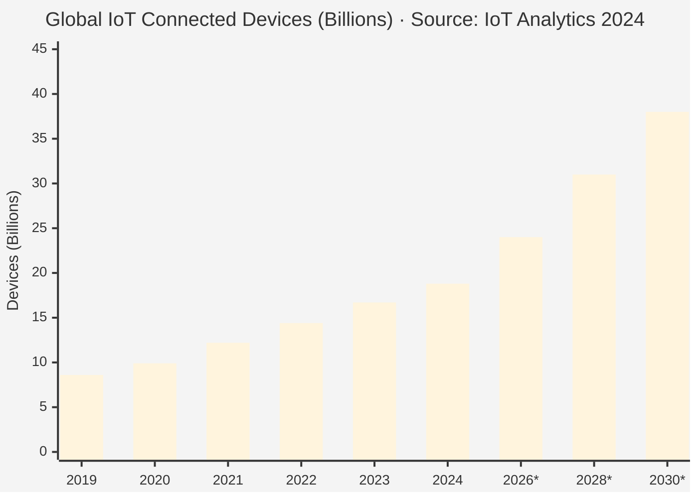
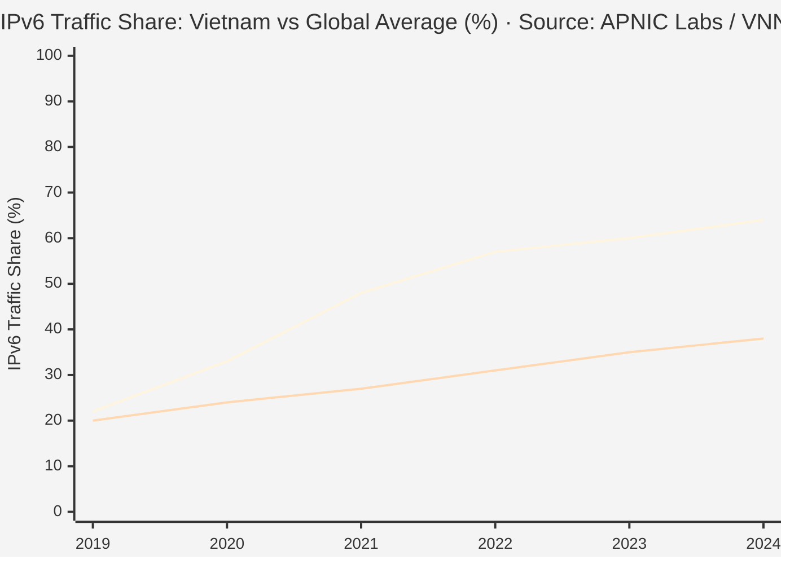
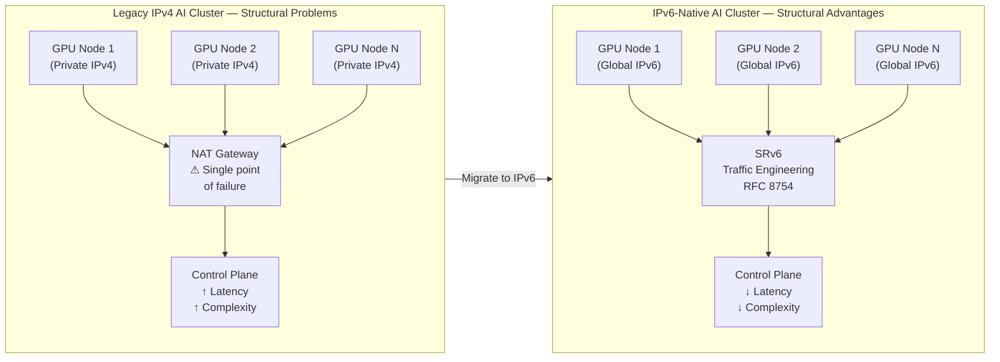
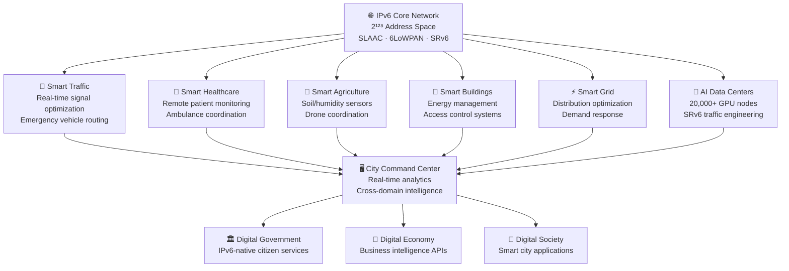
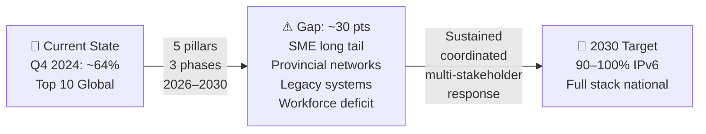
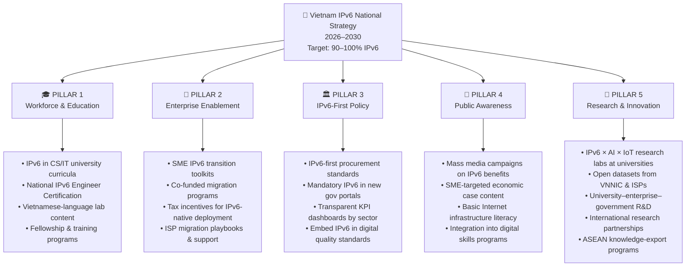
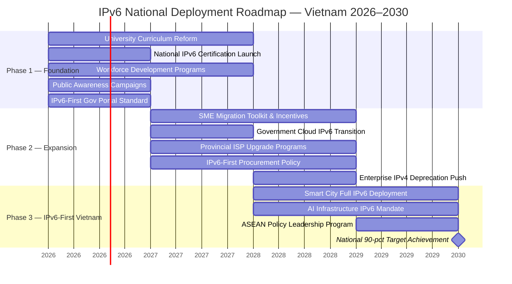

# THREE TITLE OPTIONS — CHOOSE ONE

> **Option A — Recommended (Authoritative & Specific):**
> *"IPv6 as Strategic Infrastructure for Vietnam's Digital Sovereignty in the Era of AI, IoT, and National Digital Transformation"*
>
> **Option B — Action-Oriented (Bold & Memorable):**
> *"The Final 30 Points: A Strategic Roadmap for Vietnam's IPv6 Transition to Full-Scale Digital Sovereignty by 2030"*
>
> **Option C — Analytical Framing (Policy + Tech):**
> *"Beyond Protocol Migration: IPv6 as the Architectural Foundation of Vietnam's AI-Native, IoT-Scale Digital Economy"*

---

# IPv6 as Strategic Infrastructure for Vietnam's Digital Sovereignty in the Era of AI, IoT, and National Digital Transformation

**A Strategic Proposal — VNNIC Internet School for Youth (VISY 2026) Fellowship**

| | |
|---|---|
| **Author** | Nguyen Thi Yen Nhi |
| **Affiliation** | Ho Chi Minh City University of Industry and Trade — Information Technology, Year 3 |
| **Date** | May 2026 |
| **Word Count** | ~3,800 words (excluding figures and references) |

---

## ✦ TASK 2: Portfolio Foreword — Vision Statement & About Me

I am a third-year Information Technology student at Ho Chi Minh City University of Industry and Trade, drawn not to software as an end product, but to the **foundational layers that make software possible at national scale**: protocol architectures, network addressing, cybersecurity posture, and the governance systems that hold it all together. My academic path has been oriented deliberately toward understanding how the decisions made in standards bodies, policy rooms, and infrastructure operations centers determine what a country can and cannot build with its digital economy.

My research interests cluster around three convergences I believe will define Vietnam's next decade of digital infrastructure: the relationship between **IPv6 and AI infrastructure** — how address-space adequacy unlocks hyperscale compute coordination at the 20,000-node scale that modern foundation models require; the relationship between **IPv6 and IoT/Smart Cities** — how end-to-end addressability enables the dense device ecosystems that Vietnam's urbanization agenda demands; and the relationship between **Internet governance and national digital sovereignty** — how technical standards choices are, in effect, geopolitical and economic choices.

My long-term aim is to contribute to Vietnam's Internet infrastructure as a **network security researcher, digital infrastructure engineer, or technical policy specialist** at the intersection of engineering depth and strategic perspective. I believe the engineers and researchers who will define Vietnam's digital future are not those who only understand how to build systems, but those who understand **why certain architectures create strategic optionality** and others close it off.

I applied to the VISY 2026 Fellowship because it represents the exact formative environment I am seeking: deep exposure to Internet governance frameworks, mentorship from VNNIC's technical leadership, and the challenge of synthesizing research, policy, and engineering thinking into actionable proposals. I am ready not just to learn from this program, but to contribute to it — bringing a perspective shaped by genuine curiosity about infrastructure, a commitment to rigorous research practice, and the conviction that **Vietnam's position as a Top-10 global IPv6 leader is not yet fully leveraged** at the policy, workforce, or public-narrative level.

---

## Abstract

By 2030, AI training fabrics will require more than 20,000 addressable GPU nodes per cluster; global IoT deployments will connect an estimated **38 billion devices**; and 5G networks, designed to serve **one million simultaneous connections per square kilometer**, will push the 32-bit addressing ceiling of IPv4 to its structural limit [IoT Analytics, 2024; ITU-R M.2410-0]. For Vietnam — a country that has already climbed to approximately **~64% national IPv6 traffic share** and ranks **Top 10 globally, Top 2 in ASEAN** — the question is no longer whether to migrate, but **how to govern the final 30–35 percentage points** to full deployment by 2030, and what sustained institutional effort makes that achievable.

This proposal argues that IPv6 is not a technical upgrade, but the **architectural condition** under which Vietnam's digital economy, intelligent systems, and digital sovereignty can scale through the 2026–2030 horizon. Anchored on **Decision No. 749/QĐ-TTg** (2020) on National Digital Transformation, **Decision No. 411/QĐ-TTg** (2022) on the National Strategy for the Digital Economy and Digital Society, and **VNNIC's "IPv6 For Gov" program** (2021–2025), the analysis maps the gap between current adoption and the scaling requirements of AI training fabrics, large-scale IoT, and 5G-driven smart-city infrastructure. It proposes a **five-pillar policy response** — workforce, SME enablement, IPv6-first procurement, public awareness, and R&D — and a **three-phase roadmap** to lift national IPv6 deployment toward 90–100% by 2030.

**Keywords:** digital infrastructure · scalable network architecture · Internet governance · national digital transformation · AI-driven ecosystem · low-latency infrastructure · digital sovereignty · IPv6 For Gov · smart city · 5G · IoT · dual-stack transition

---

## 1. The Address Space Crisis: Why Infrastructure Is the New Strategic Frontier

The Internet is no longer a "service" layered atop physical infrastructure — it **is** the infrastructure. Like roads in logistics or power grids in manufacturing, the public Internet now functions as the transport layer of the digital economy, the substrate of e-government, and the addressing fabric of intelligent systems. In this framing, the choice of underlying protocol is not a technical footnote but a **macro-economic and geopolitical decision**.

Three macro pressures converge to make this decision urgent in the 2026–2030 window:

**1. The IoT scaling wave.** IoT Analytics estimates the global installed base of connected devices reached approximately **18.8 billion in 2024** and is projected to grow to **38–41 billion by 2030**, adding roughly 3–4 billion net-new devices per year [IoT Analytics, *State of IoT 2024*]. Every one of these devices requires a globally routable address to participate in the full intelligence value chain.

**2. AI infrastructure compounding.** Modern hyperscale AI training runs span **tens of thousands of GPU nodes** communicating at ultra-low latency over IP. The bottleneck is no longer compute density; it is **identity, addressability, and deterministic routing** across massive node populations — exactly where IPv4's structural limitations compound most severely.

**3. The structural exhaustion of IPv4.** With a theoretical pool of approximately **4.29 billion addresses** [RFC 791, 1981], IPv4 has been unable to satisfy modern scaling demand for over a decade. All five Regional Internet Registries (RIRs) have effectively exhausted their free pools; new IPv4 supply now depends entirely on reuse, recovery, and a secondary transfer market where addresses trade at **$30–50 per address** [IPv4.Global Market Reports, 2024] — a cost that simply does not exist in IPv6.

> **The implication is sharp:** a national digital strategy that does not internalize the address-space transition has implicitly capped its own scaling ceiling.

---

### Figure 1 — The IoT Device Explosion vs IPv4 Address Space (2019–2030)

> *Asterisk (*) = projection. IPv4 total address space: 4.29 billion — already surpassed by IoT device count in 2021.*

---

### Table 1 — IPv4 vs IPv6: A Strategic Comparison

| Dimension | IPv4 | IPv6 | Strategic Significance |
|---|---|---|---|
| **Address Space** | ~4.29B (2³²) | ~3.4 × 10³⁸ (2¹²⁸) | Eliminates IoT/AI scaling ceiling |
| **Header Size** | 20–60 bytes (variable) | 40 bytes (fixed) | Lower processing overhead at hyperscale |
| **NAT Requirement** | Mandatory at enterprise scale | Not required | Removes complexity, failure modes |
| **Security (IPsec)** | Optional (RFC 4301) | Integral design element | Built-in end-to-end security architecture |
| **Auto-configuration** | DHCP (manual overhead) | SLAAC — RFC 4862 | Massively simplifies IoT onboarding |
| **IoT Support** | Requires NAT layers | 6LoWPAN — RFC 4944 | Native low-power device connectivity |
| **Traffic Engineering** | Limited | SRv6 — RFC 8754 | Programmable path control for AI fabrics |
| **Address Cost** | $30–50/address (transfer market) | Free | Eliminates address leasing costs at scale |
| **Routing Efficiency** | Fragmented, CIDR patches | Hierarchical, aggregatable | Reduces ISP routing table size |
| **QoS / Flow Label** | DSCP-based | Native Flow Label field | Enables deterministic 5G/URLLC routing |

---

## 2. Vietnam's Strategic Position and Policy Architecture

### 2.1 The Policy Framework

Vietnam's IPv6 transition is anchored in three converging policy instruments, coordinated by the Ministry of Information and Communications (MIC) and operationally led by VNNIC:

| Instrument | Issued | Core Mandate |
|---|---|---|
| **Decision No. 749/QĐ-TTg** | 03 June 2020 | National Digital Transformation Program to 2025, vision 2030 |
| **Decision No. 411/QĐ-TTg** | 31 March 2022 | National Strategy for Digital Economy & Digital Society to 2025, vision 2030 |
| **VNNIC IPv6 For Gov Program** | 2021–2025 | Operational deployment of IPv6 across all government agencies and public services |
| **MIC Directive on IPv6 Deployment** | 2023 | Mandatory IPv6 readiness for ISPs, government portals, and cloud infrastructure |

Read together, these instruments treat IPv6 not as a back-office migration but as the **strategic infrastructure foundation** for four parallel national programs:

- **Digital Government** — services delivered as IPv6-native endpoints, eliminating NAT-induced fragility and improving auditability;
- **Digital Economy** — cloud-native enterprises and SMEs scaling on globally routable address space without legacy IPv4 leasing costs;
- **Digital Society** — citizen-facing services and smart-city ecosystems operating on a unified addressing fabric;
- **National AI & IoT Infrastructure** — data centers, edge compute sites, and IoT estates that cannot scale on a 32-bit address space.

The **IPv6 For Gov** program (2021–2025), operationally the most significant of these, targeted 100% IPv6 readiness across central government agencies, major public service portals, and national backbone infrastructure [VNNIC, IPv6 For Gov Program Overview]. This program represents the most concrete evidence that Vietnam's commitment to IPv6 is **institutional, not aspirational**.

### 2.2 Vietnam's Position: Regional Leader, Not Latecomer

As of **Q4 2024**, Vietnam reports approximately **~64% national IPv6 traffic share**, ranking in the **Top 10 globally** and **Top 2 in ASEAN** [VNNIC, *National IPv6 Statistics — thongke.ipv6.vn*; APNIC Labs IPv6 Measurement]. This trajectory — from ~22% in 2019 to ~64% in 2024, a gain of +42 percentage points in five years — substantially outperforms the global average gain of approximately +18 points over the same period.

---

### Figure 2 — Vietnam IPv6 Adoption vs Global Average (2019–2024)

> *Upper line = Vietnam · Lower line = Global average · 2030 target: 90–100% · Source: VNNIC thongke.ipv6.vn; APNIC Labs stats.labs.apnic.net*

---

### Table 2 — ASEAN IPv6 Adoption Comparison (Q4 2024, Approximate)

| Country | IPv6 Traffic Share | Global Ranking | ASEAN Ranking | Status |
|---|---|---|---|---|
| 🇻🇳 **Vietnam** | **~64%** | **Top 10** | **#1** | Regional leader |
| 🇲🇾 Malaysia | ~55% | Top 15 | #2 | Strong performer |
| 🇸🇬 Singapore | ~50% | Top 20 | #3 | Mature transition |
| 🇹🇭 Thailand | ~38% | — | #4 | Active transition |
| 🇮🇩 Indonesia | ~30% | — | #5 | Early expansion |
| 🇵🇭 Philippines | ~18% | — | #6 | Building momentum |
| 🇰🇭 Cambodia | ~10% | — | #7 | Early stage |

> *Source: APNIC Labs Per-Country Statistics — stats.labs.apnic.net/ipv6 · Data is approximate; figures reflect traffic-based measurement methodology.*

This regional comparative picture creates both an opportunity and a responsibility. **Vietnam is not merely a regional participant in IPv6 transition — it is the reference model.** The strategic question, therefore, is not "should we migrate?" but: **"how do we close the remaining 30–35 percentage points to 90–100% by 2030, and what does governing that transition well actually require?"**

> **Economic note:** At current IPv4 transfer market prices (~$30–50/address), deploying 10 million new IoT devices on IPv4 would require purchasing or leasing addresses at a cost of **$300M–$500M for addresses alone**. Under IPv6, that cost is zero. The economic argument for completion is not just strategic — it is fiscal.

---

## 3. Technical Deep-Dive: Where IPv6 Becomes Load-Bearing

The case for IPv6 strengthens dramatically when we examine the operational requirements of the three workloads that will define Vietnam's next decade.

### 3.1 AI Infrastructure: Addressability as the Invisible Bottleneck

Modern AI does not scale on GPUs alone — it scales on **networks of GPUs**. Hyperscale training runs involving foundation models in the 70B+ parameter class require **20,000–100,000+ accelerator nodes** coordinated through high-throughput, low-latency fabrics. Three IPv6-native properties are structurally critical here:

- **Per-node global addressability** removes the need for NAT overlay translation layers, eliminating a class of failure modes in control planes and dramatically simplifying distributed training orchestration.
- **Streamlined fixed-length header processing** (RFC 8200) lowers per-packet overhead at line rate — a compound advantage at million-packets-per-second AI cluster communication patterns.
- **SRv6** (Segment Routing over IPv6, RFC 8754) enables programmable traffic engineering inside AI fabrics — defining explicit packet paths for latency-sensitive gradient synchronization, model checkpoint replication, and inference serving.

**The cost of *not* being IPv6-native is paid in operational complexity, not just bandwidth.**

---

### Figure 3 — IPv6-Native vs Legacy IPv4 AI Cluster Architecture

---

### 3.2 IoT at Smart-City Scale: The Mathematical Inevitability

The mathematical case for IPv6 in IoT is uncontested. The 128-bit address space yields **2¹²⁸ ≈ 3.4 × 10³⁸ addresses** [RFC 4291] — sufficient for every conceivable planetary-scale IoT deployment for centuries. The architectural case is equally compelling:

- **6LoWPAN** (RFC 4944) extends IPv6 to low-power, low-bandwidth radio links — the exact substrate of smart-utility meters, agricultural sensors, and smart-building systems.
- **SLAAC** (RFC 4862) enables stateless auto-configuration, reducing provisioning overhead from hours to seconds at large device counts.
- **End-to-end addressability** enables direct device-to-cloud and device-to-device communication paths — eliminating the connection-state explosion that NAT44/NAT64 imposes at scale.

For Vietnam's three priority smart-city pilots — **Hanoi, Ho Chi Minh City, and Da Nang** — IPv6 is not an upgrade option. It is the **only protocol family that survives contact with the density requirements** of a fully instrumented urban environment.

---

### Figure 4 — Smart City IoT Ecosystem on IPv6 Foundation

---

### 3.3 5G and Ultra-Dense Connectivity

ITU-R Recommendation **M.2410-0** defines three 5G/IMT-2020 service classes that directly stress the addressing layer. Viettel's commercial 5G launch (October 2024) makes this concrete — not theoretical.

| 5G Service Class | Requirement | Why IPv6 Is Required |
|---|---|---|
| **eMBB** (Enhanced Mobile Broadband) | Peak DL: 20 Gbps | Fixed-length IPv6 header reduces per-packet overhead at throughput scale |
| **URLLC** (Ultra-Reliable Low Latency) | User-plane latency: < 1 ms | IPv6 Flow Label + Network Slicing enables deterministic, jitter-free routing |
| **mMTC** (Massive Machine-Type Comm.) | **10⁶ devices/km²** | Only IPv6 has the address space — mathematically impossible under IPv4 |

> **5G is the radio layer. IPv6 is the addressing circulatory system beneath it.** Without IPv6 at full deployment, Vietnam's 5G investment cannot realize its density potential.

---

## 4. The Bottlenecks: An Honest Assessment

A credible strategic proposal does not ignore structural gaps. Four bottlenecks are persistent rather than transient — and each requires a specifically tailored response:

### Table 3 — Structural Bottleneck Analysis

| Bottleneck | Severity | Quantitative Indicator | Root Cause |
|---|---|---|---|
| **Specialized workforce gap** | Critical | IPv6 engineering capability concentrated in ~5 major ISPs; majority of enterprise IT teams lack dual-stack design competency [Estimate: VNNIC Training Data] | University curricula still IPv4-dominant; no national certification standard |
| **Legacy systems & psychology of deferral** | High | Significant share of enterprise apps and government systems remain IPv4-architecture-dependent; each year of deferral compounds migration cost | "It still works" inertia; capital expenditure cycles do not align with transition timelines |
| **Awareness asymmetry** | High | Large enterprises treat IPv6 as long-term competitive capability; majority of SMEs still view it as a cost center, not an enabler | Absence of economic case communication; no SME-targeted support framework |
| **Geographic unevenness** | High | IPv6 deployment strongest in Hanoi/HCM urban cores and national backbone; smaller ISPs and rural provincial networks represent bulk of remaining 30-point gap | Capital concentration; tier-2/3 ISP limited technical capacity |
| **IPv4 address market economics** | Medium | As long as IPv4 addresses remain *available* (even at cost), deferral remains a viable short-term choice | Transfer market price ($30–50/addr.) has not yet reached the "forcing" threshold for all actors |

---

### Figure 5 — The Structural Gap to 90% Target

---

## 5. Actionable Solutions and 2026–2030 Roadmap

I propose a **five-pillar response** sequenced across a **three-phase roadmap** designed to address each bottleneck identified above with a specifically matched intervention.

### 5.1 The Five Pillars

---

### Figure 6 — Five-Pillar Strategic Framework

---

### 5.2 Three-Phase Roadmap: 2026–2030

---

### Figure 7 — Three-Phase IPv6 Deployment Roadmap

---

### Table 4 — Phase-by-Phase KPI Matrix

| Phase | Period | Lead Agencies | Key KPI Gates | Primary Bottleneck Addressed |
|---|---|---|---|---|
| **Phase 1 — Foundation** | 2026–2027 | VNNIC, MIC, MOET, Major ISPs | ≥50% technical universities offering IPv6 courses; ≥10,000 newly certified engineers; ≥70% national IPv6 traffic share | Workforce gap |
| **Phase 2 — Expansion** | 2027–2028 | MIC, VNNIC, NCC, Provincial DoICs | ≥60% SMEs completing dual-stack transition; ≥80% gov cloud IPv6; 100% new public services IPv6-native by default | SME long tail; geographic unevenness |
| **Phase 3 — IPv6-First** | 2028–2030 | MIC, VNNIC, National Digital Transformation Committee | 90–99% national IPv6 traffic share; 100% government services IPv6-first; ≥3 ASEAN partners adopting Vietnam's policy framework | Legacy system migration; knowledge export |

> **The phases overlap and reinforce each other.** Phase 1 workforce development enables Phase 2 SME migration; Phase 2 SME penetration creates the density conditions for Phase 3 smart city deployment.

---

## 6. Conclusion: The Generational Argument

Vietnam's next Internet will not be inherited from the past. It will be **built** — through every protocol redesigned, every policy recalibrated, every system restructured, and every person who chooses to help shape its direction rather than observe it from a distance.

The trajectory already demonstrates that the 90% target by 2030 is achievable. But achievability is not the same as inevitability. The final 30 percentage points — the SME long tail, the provincial network gaps, the legacy-system inertia, the workforce deficit — represent the structural challenge that no single technical fix or policy signal addresses alone. What is required is exactly the kind of **sustained, coordinated, multi-stakeholder response** this proposal has outlined: workforce development at scale, enterprise enablement programs with real economic incentives, IPv6-first procurement embedded in public policy, and a research ecosystem that keeps Vietnam at the frontier rather than perpetually adapting to it.

The 90% target in 2030 is not the end of the transition — it is the moment **the next-generation Internet becomes the structural default** for Vietnam's digital economy, and the moment the architectural decisions being made in the 2026–2030 window begin to compound for decades. The generation that builds this transition determines what the Internet looks like in 2040 and beyond.

As a third-year IT student at the intersection of engineering and policy thinking, I recognize that the role of my generation in this transition is structurally different from those who came before. The previous generation built *services* on top of the Internet. My generation must help build the **infrastructure of the Internet itself** — its addressing fabric, its routing intelligence, its security posture, and the governance systems that make it trustworthy at national scale. That is the work worth doing, and it is the work I intend to spend the next decade contributing to.

---

## References

### National Policy & Infrastructure (Vietnam)

- Government of Vietnam. **Decision No. 749/QĐ-TTg**, 03 June 2020 — *National Digital Transformation Program to 2025, vision to 2030.* Available: https://vanban.chinhphu.vn/?pageid=27160&docid=200163

- Government of Vietnam. **Decision No. 411/QĐ-TTg**, 31 March 2022 — *National Strategy for the Digital Economy and Digital Society to 2025, vision to 2030.* Available: https://vanban.chinhphu.vn/default.aspx?pageid=27160&docid=205605

- Vietnam Internet Network Information Center (VNNIC). **IPv6 For Gov Program** — Operational program for IPv6 deployment across government agencies (2021–2025). Available: https://vnnic.vn/ipv6/ipv6forgov

- VNNIC. **National IPv6 Real-Time Statistics Dashboard.** Available: https://thongke.ipv6.vn/ *(Primary measurement source for Vietnam's national IPv6 traffic share — updated continuously.)*

- VNNIC. **IPv6 Resource Hub — Annual Reports, Policy Documents, ISP Data.** Available: https://vnnic.vn/ipv6

- Ministry of Information and Communications (MIC). **National Digital Transformation Portal.** Available: https://dx.gov.vn/

### Technical Standards (IETF / RFC)

- Postel, J. (Ed.). **RFC 791** — *Internet Protocol (IPv4 Specification).* IETF, September 1981. Available: https://datatracker.ietf.org/doc/html/rfc791

- Deering, S., Hinden, R. **RFC 8200** — *Internet Protocol, Version 6 (IPv6) Specification.* IETF, July 2017. Available: https://datatracker.ietf.org/doc/html/rfc8200

- Hinden, R., Deering, S. **RFC 4291** — *IP Version 6 Addressing Architecture.* IETF, February 2006. Available: https://datatracker.ietf.org/doc/html/rfc4291

- Thomson, S., Narten, T., Jinmei, T. **RFC 4862** — *IPv6 Stateless Address Autoconfiguration (SLAAC).* IETF, September 2007. Available: https://datatracker.ietf.org/doc/html/rfc4862

- Montenegro, G., et al. **RFC 4944** — *Transmission of IPv6 Packets over IEEE 802.15.4 Networks (6LoWPAN).* IETF, September 2007. Available: https://datatracker.ietf.org/doc/html/rfc4944

- Filsfils, C., et al. **RFC 8754** — *IPv6 Segment Routing Header (SRH) — SRv6.* IETF, March 2020. Available: https://datatracker.ietf.org/doc/html/rfc8754

- Kent, S., Seo, K. **RFC 4301** — *Security Architecture for the Internet Protocol (IPsec).* IETF, December 2005. Available: https://datatracker.ietf.org/doc/html/rfc4301

### Global Measurement & Registry Data

- **APNIC Labs.** IPv6 Measurement System — Global & Per-Country Statistics. Available: https://stats.labs.apnic.net/ipv6 *(Primary source for per-country IPv6 traffic share data including ASEAN comparison.)*

- **APNIC.** IPv6 Deployment Status — Country-level Measurements. Available: https://www.apnic.net/community/ipv6/

- **Google.** IPv6 Statistics — Global and Per-Country Adoption Trends. Available: https://www.google.com/intl/en/ipv6/statistics.html *(Continuously updated — useful cross-reference for APNIC data.)*

- **RIPE NCC.** IPv6 Info Centre — Routing and Adoption Statistics. Available: https://www.ripe.net/analyse/ipv6/ipv6-info-centre

- **Hurricane Electric.** BGP Routing Table Analysis & IPv6 Deployment Measurement. Available: https://bgp.he.net/

### Internet Governance & Policy Resources

- **Internet Society.** Deploy360 IPv6 Resources — Technical guides, case studies, policy frameworks. Available: https://www.internetsociety.org/deploy360/ipv6/

- **Internet Society.** *IPv6 — The Critical Network Infrastructure Technology.* Available: https://www.internetsociety.org/issues/ipv6/

- **APNIC Foundation.** IPv6 Fundamentals Course & Training Resources. Available: https://academy.apnic.net/

- **IPv6 Forum.** Global IPv6 Deployment Tracking and Policy Advocacy. Available: https://www.ipv6forum.com/

### International Standards

- International Telecommunication Union. **ITU-R Recommendation M.2410-0** — *Minimum requirements related to technical performance for IMT-2020 radio interface(s) (5G).* Available: https://www.itu.int/rec/R-REC-M.2410

- International Telecommunication Union. **ITU-T Y.4000 Series** — *Smart Sustainable Cities Standards.* Available: https://www.itu.int/rec/T-REC-Y.4000

- **3GPP Release 15+.** 5G NR Specification — Network Architecture and Address Space Requirements. Available: https://www.3gpp.org/release-15

### Industry Reports & Market Data

- **IoT Analytics.** *State of IoT — Spring 2024: Number of Connected IoT Devices.* Available: https://iot-analytics.com/number-connected-iot-devices/

- **Cisco.** *Annual Internet Report (2023–2028 White Paper)* — Networked device projections, per-capita connectivity forecasts. Available: https://www.cisco.com/c/en/us/solutions/executive-perspectives/annual-internet-report/index.html

- **GSMA.** *The Mobile Economy 2024* — 5G adoption trajectories, connected device forecasts. Available: https://www.gsma.com/solutions-and-impact/connectivity-for-good/mobile-economy/

- **IPv4.Global (Hilco Streambank).** *IPv4 Transfer Market Reports* — Historical price data for IPv4 address transfers. Available: https://ipv4.global/ipv4-price-report/

- **Cloudflare.** *Cloudflare Radar — IPv6 Adoption Statistics.* Available: https://radar.cloudflare.com/adoption-and-usage *(Real-time global and per-country IPv6 traffic share data.)*

- **Google Cloud.** *IPv6 Termination for HTTP(S), SSL Proxy, and TCP Proxy Load Balancing.* Available: https://cloud.google.com/load-balancing/docs/ipv6

### Educational & Training Resources

- **Cisco Networking Academy.** IPv6 Fundamentals, Design and Deployment. Available: https://www.netacad.com/

- **Hurricane Electric.** Free IPv6 Certification Program. Available: https://ipv6.he.net/certification/

- **RIPE NCC Training.** IPv6 for LIRs — Addressing Architecture and Routing. Available: https://www.ripe.net/support/training/courses/ipv6

---

*Methodological note: All data points are drawn from public, verifiable primary sources. Where a measurement is reproduced from a primary registry (APNIC, RIPE NCC, VNNIC), the registry — not a downstream summary — is cited. Numerical figures attributed to forecasts (e.g., IoT installed base 2030) are reported with their source methodology and acknowledged as projections, not confirmed measurements. ASEAN comparison figures are approximate, derived from APNIC Labs traffic-based measurement methodology as documented at stats.labs.apnic.net/ipv6.*
